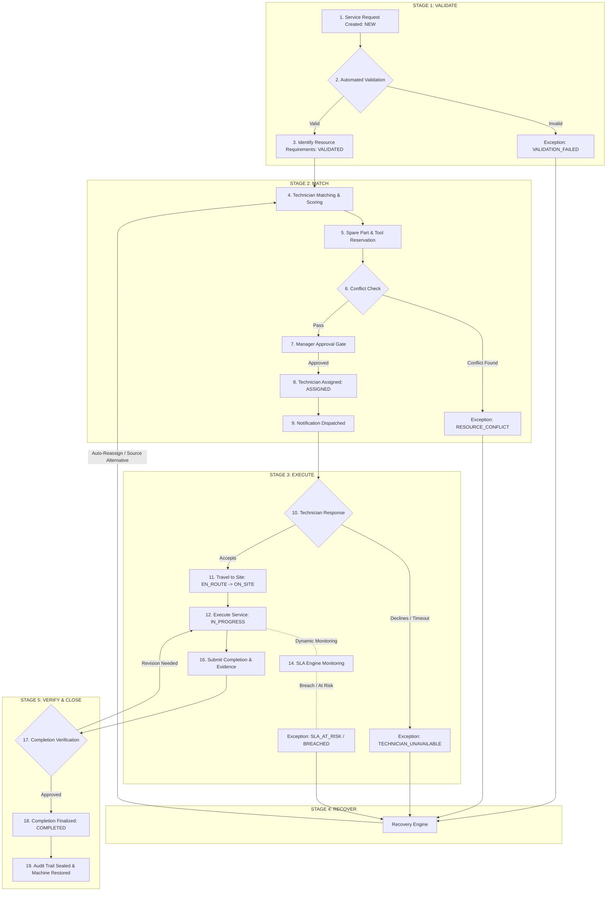

# DataQuest 3.0 --- EquiNox-FSM Platform Specification & Implementation Blueprint
## Next-Generation Activity Management Platform for Industrial Equipment Services

---

## 1. Executive Summary & Objective

This document defines the formal specifications for transforming **EquiNox-FSM** from a conventional computer maintenance management system (CMMS) into an **autonomous operational orchestration platform** compliant with the **DataQuest 3.0 Industrial Equipment Service Workflow**.

The core objective is to replace disconnected tools, spreadsheets, manual messaging, and static ticketing with a connected operational platform governed by the five pillars:

$$\mathbf{VALIDATE} \longrightarrow \mathbf{MATCH} \longrightarrow \mathbf{EXECUTE} \longrightarrow \mathbf{RECOVER} \longrightarrow \mathbf{VERIFY}$$

---

## 2. EquiNox-FSM Architectural Gap Analysis

The current EquiNox-FSM codebase comprises a Spring Boot API (`api/`), a React/TypeScript web client (`frontend/`), and a React Native mobile client (`mobile/`). Below is the direct mapping and gap analysis between current capabilities and the DataQuest 3.0 specification:

| # | Workflow / Functional Area | Existing EquiNox-FSM State | Required DataQuest 3.0 State | Architectural Modifications Needed |
|---|---------------------------|----------------------------|------------------------------|-----------------------------------|
| 1 | **Request Lifecycle & State Machine** | Basic `Status` enum (`OPEN`, `IN_PROGRESS`, `ON_HOLD`, `COMPLETE`) across `Request` and `WorkOrder`. | 12-state granular lifecycle: `NEW` $\to$ `VALIDATING` $\to$ `VALIDATED` $\to$ `PENDING_APPROVAL` $\to$ `APPROVED` $\to$ `ASSIGNED` $\to$ `ACCEPTED` $\to$ `EN_ROUTE` $\to$ `ON_SITE` $\to$ `IN_PROGRESS` $\to$ `COMPLETION_SUBMITTED` $\to$ `VERIFICATION` $\to$ `COMPLETED`. | Extend `Status.java` / Create `OrchestrationStatus.java`; implement finite state machine with strict transition guards and automated event emission. |
| 2 | **Validation Subsystem** | Basic form validations (null checks, string lengths). No automated operational eligibility checks. | Multi-point automated server-side validation: Machine eligibility/active registration, valid site coordinates, skill requirements, and spare parts stock checks. | Implement `ValidationService` with automated evaluation rules yielding `VALIDATED` or `EXCEPTION: VALIDATION_FAILED`. |
| 3 | **Technician Profiles & Skills** | Generic `User` entity with basic contact info and static `Role`. No skills matrix or proficiency rating. | Dedicated `Skill` and `TechnicianSkill` associations with certification levels and real-time availability/workload tracking. | Add `Skill` and `TechnicianSkill` JPA models; expose skill management in admin/technician settings. |
| 4 | **Matching & Scoring Engine** | Manual user assignment dropdown without suitability assessment. | Explainable multi-factor scoring model: $\text{Score} = w_s S_{skill} + w_a S_{avail} + w_l S_{loc} + w_w S_{load} + w_p S_{prio}$ with human-readable rationale. | Implement `AssignmentEngineService` with scoring algorithms, geospatial distance calculation, and explainability payload generator. |
| 5 | **Resource & Part Reservation** | Direct deduction of `quantity` on `Part` upon work order usage. | 3-stage inventory lifecycle: $\text{Available} \to \text{Reserved} \to \text{Consumed}$. Prevents double-allocation across concurrent requests. | Introduce `PartReservation` entity; lock quantities upon manager approval, release on exception/reassignment, and consume on verification. |
| 6 | **Conflict Detection** | No validation against overlapping assignments or concurrent resource usage. | Automated conflict detection checking technician schedule overlaps, concurrent part reservations, tool collisions, and travel time SLA feasibility. | Create `ConflictDetectionService` invoked before assignment and during re-routing. |
| 7 | **SLA Monitoring Engine** | Static due date check (`dueDate`) with binary compliance flag. | Real-time SLA engine with active countdown timers, warning thresholds ($\text{ON\_TRACK}$, $\text{AT\_RISK}$ at $< 25\%$ remaining), and breach escalations. | Create background scheduler (`SlaMonitoringScheduler`) with WebSocket broadcasts and threshold alert events. |
| 8 | **Exception Handling & Recovery** | Manual ticket reopening or marking "on hold" with no automated recovery assistance. | Comprehensive exception engine handling `TECHNICIAN_UNAVAILABLE`, `PART_UNAVAILABLE`, `RESOURCE_CONFLICT`, `SLA_AT_RISK`, `SLA_BREACHED`, with 1-click auto-recovery re-ranking. | Create `ExceptionEngineService` and `ServiceException` model supporting self-healing technician reassignments and alternative stock routing. |
| 9 | **Execution Telemetry** | Checklists and comments entered asynchronously without granular travel or on-site status tracking. | Granular travel & execution telemetry: `ACCEPTED` $\to$ `EN_ROUTE` $\to$ `ON_SITE` $\to$ `IN_PROGRESS`, logging parts used, measurements, before/after media. | Enhance technician UI and API endpoints to record telemetry milestones and mandatory evidence collection. |
| 10 | **Verification & Closure Gate** | Simple complete action with optional signature. | Formal verification step: Manager/Customer reviews before/after photo evidence, parts used, and service report before final sign-off. | Implement `VerificationService` that atomically flips Machine $\to$ `OPERATIONAL`, Part $\to$ `CONSUMED`, Technician $\to$ `AVAILABLE`. |
| 11 | **Traceability & Audit** | Hibernate Envers entity audit tables (technical database revisions). | Human-readable, chronological 19-step operational timeline capturing actors, timestamps, transitions, reasons, and evidence hashes. | Create `ServiceAuditEvent` entity and dedicated timeline component in the frontend. |

---

## 3. The 19-Step End-to-End Orchestration Workflow



### Detailed Workflow Step Specifications

#### 1. Service Request Creation
- **Trigger**: Customer, technician, supervisor, or IoT anomaly alert.
- **Payload**: Machine ID (`assetId`), Location/Site ID (`locationId`), Issue description, Priority (`LOW`, `MEDIUM`, `HIGH`, `URGENT`), and Required Skill.
- **Initial Status**: `NEW`.

#### 2. Request Validation
- **Engine**: Automated `ValidationService`.
- **Validation Checklist**:
  1. Machine active & eligible for service.
  2. Site active and geo-coordinates resolved.
  3. Priority valid and mapped to SLA tier.
  4. Required skill recognized in system catalog.
  5. Required spare parts present in inventory.
- **Output**: `VALIDATED` on success, or `VALIDATION_FAILED` triggering an exception.

#### 3. Determine Resource Requirements
- Synthesizes the execution bill of resources:
  - Skill classification: (e.g. Hydraulics, Level 2).
  - Technician count: 1.
  - Spare parts: Part ID and required quantity.
  - Specialized tools: Calibration kit / diagnostic rig.
  - SLA Target: e.g. 60 minutes for `URGENT`.

#### 4. Technician Matching & Scoring
- Computes suitability score $S(T, R) \in [0, 100]$ across all eligible technicians:
  $$S(T, R) = 0.35 \times S_{skill} + 0.25 \times S_{avail} + 0.20 \times S_{loc} + 0.10 \times S_{load} + 0.10 \times S_{prio}$$
- Provides transparent explanation strings for ranking recommendations.

#### 5. Spare Part & Resource Reservation
- Locks required parts into `RESERVED` status.
- Decrements available stock count without recording final consumption until completion.

#### 6. Conflict Detection
- Performs collision check:
  - Is technician already assigned to a non-overlapping slot?
  - Does travel time exceed SLA window?
  - Are tools or parts double-booked?

#### 7. Manager Approval Gate
- Displays curated approval card in Manager Command Center showing machine, site, recommended technician with score breakdown, and reserved parts.
- Actions: `APPROVE` or `REJECT`.

#### 8. Assignment
- Creates formal `Assignment` record. Status moves to `ASSIGNED`.

#### 9. Real-Time Notification
- Pushes instant notification over WebSockets, Push, and SMS to technician mobile/web client.

#### 10. Technician Acceptance
- Technician responds: `ACCEPT` or `DECLINE`.
- Declining immediately triggers `TECHNICIAN_UNAVAILABLE` exception and recovery workflow.

#### 11. Travel to Site
- Status transitions: `ACCEPTED` $\to$ `EN_ROUTE` $\to$ `ON_SITE`.
- Customer tracker reflects live travel status and ETA.

#### 12. Service Execution
- Status transitions to `IN_PROGRESS`.
- Technician logs measurements, work description, photos, and parts unboxed.

#### 13. Live Status Updates
- Continuous real-time updates broadcast to Manager Command Center and Customer portal.

#### 14. SLA Monitoring
- Real-time SLA engine monitors remaining time:
  - 🟢 `SLA_ON_TRACK`: Remaining time $> 25\%$.
  - 🟡 `SLA_AT_RISK`: Remaining time $\le 25\%$; sends proactive manager alert.
  - 🔴 `SLA_BREACHED`: Overdue; auto-escalates to incident response.

#### 15. Exception Handling & Recovery
- Automatic recovery scenarios:
  - **Technician Dropout**: Re-scores available pool excluding the dropped technician and suggests replacement with single-click reassignment.
  - **Part Unavailable**: Queries regional warehouse stock and estimates transfer ETA.
  - **SLA Breach**: Suggests dispatching secondary support technician.

#### 16. Completion Submission
- Technician uploads completion dossier:
  - Detailed service notes.
  - Before and After photographic evidence.
  - Exact parts consumed.
  - Operating telemetry measurements.
- Status: `COMPLETION_SUBMITTED`.

#### 17. Completion Verification
- Manager or Customer inspects submitted dossier.
- Actions: `APPROVE COMPLETION` or `REQUEST REVISION`.

#### 18. Completion Finalized
- Atomic final state transition:
  - Machine Status: `UNDER_MAINTENANCE` $\to$ `OPERATIONAL`.
  - Part Status: `RESERVED` $\to$ `CONSUMED`.
  - Technician Status: `BUSY` $\to$ `AVAILABLE`.
  - Request Status: `COMPLETED`.

#### 19. Sealed Audit Trail
- Generates immutable operational audit certificate detailing all 19 steps, actors, timestamps, and status transitions.

---

## 4. Subsystem & Module Specifications

```
+---------------------------------------------------------------------------------------------+
|                                    EQUINOX-FSM MODULES                                      |
+---------------------------------------------------------------------------------------------+
| 1. Authentication & RBAC        | 2. Equipment & Machine Mgmt   | 3. Site & Location Mgmt   |
| 4. Service Request Management   | 5. Technician & Skills Mgmt   | 6. Resource & Part Ledger |
| 7. Matching & Scoring Engine    | 8. SLA Monitoring Engine      | 9. Exception & Recovery   |
| 10. Service Execution Telemetry | 11. Verification Gate         | 12. Real-Time Dispatch    |
| 13. Immutable Audit Trail       |                               |                           |
+---------------------------------------------------------------------------------------------+
```

### Module 1 — Authentication & Authorization
- **Roles**:
  - `CUSTOMER`: Creates service requests, tracks live status, verifies completions.
  - `TECHNICIAN`: Receives assignments, accepts/declines, records execution telemetry, submits completion evidence.
  - `MANAGER`: Reviews validations, approves assignments, manages exceptions, verifies submissions.
  - `ADMIN`: Full platform configuration, skill matrices, SLA policies, and warehouse settings.

### Module 2 — Equipment & Machine Management
- Enhanced `Asset` model with fields:
  - `machineCode` (e.g. M-104)
  - `eligibilityStatus` (`ELIGIBLE`, `WARRANTY_EXPIRED`, `DECOMMISSIONED`)
  - `operationalStatus` (`OPERATIONAL`, `UNDER_MAINTENANCE`, `DOWN`, `CRITICAL_FAILURE`)
  - `serviceHistory` links.

### Module 3 — Site & Location Management
- Enhanced `Location` model with:
  - `latitude`, `longitude` coordinates for distance scoring.
  - `siteAccessHours`, `safetyClearanceLevel`.

### Module 4 — Service Request Management
- Central orchestration entity tracking the complete 12-state lifecycle and linked resources.

### Module 5 — Technician Management
- `User` extended with:
  - Skills list (`TechnicianSkill` entity).
  - Current real-time workload (number of active jobs).
  - Real-time status (`AVAILABLE`, `ASSIGNED`, `EN_ROUTE`, `ON_SITE`, `OFF_DUTY`).

### Module 6 — Resource & Inventory Management
- `Part` extended with 3-tier status ledger:
  - Total Stock = `Available` + `Reserved` + `Consumed`.
  - Reservation transaction model `PartReservation`.

### Module 7 — Assignment & Scoring Engine
- Implements the multi-factor scoring algorithm with explainable breakdown.

### Module 8 — SLA Engine
- Manages priority-based SLA deadlines:
  - `URGENT`: 60 minutes
  - `HIGH`: 4 hours
  - `MEDIUM`: 24 hours
  - `LOW`: 72 hours
- Emits real-time warning events at 75% elapsed time.

### Module 9 — Exception & Recovery Engine
- Detects anomalies, logs `ServiceException`, and computes recovery pathways.

### Module 10 — Service Execution
- Technician digital workbench capturing telemetry, photos, and measurements.

### Module 11 — Verification Subsystem
- Quality sign-off gate comparing before/after evidence before closing work.

### Module 12 — Notifications & WebSockets
- Real-time message bus dispatching instant updates to connected clients.

### Module 13 — Audit Subsystem
- Immutable historical ledger recording every operational transition.

---

## 5. Database Schema & Data Models

```sql
-- 1. Skills Catalog
CREATE TABLE skill (
    id BIGSERIAL PRIMARY KEY,
    name VARCHAR(100) NOT NULL UNIQUE,
    category VARCHAR(50),
    description TEXT,
    company_id BIGINT NOT NULL
);

-- 2. Technician Skills
CREATE TABLE technician_skill (
    id BIGSERIAL PRIMARY KEY,
    user_id BIGINT NOT NULL REFERENCES own_user(id) ON DELETE CASCADE,
    skill_id BIGINT NOT NULL REFERENCES skill(id) ON DELETE CASCADE,
    proficiency_level VARCHAR(30) NOT NULL DEFAULT 'INTERMEDIATE', -- JUNIOR, INTERMEDIATE, SENIOR, EXPERT
    certified BOOLEAN DEFAULT TRUE,
    company_id BIGINT NOT NULL
);

-- 3. Part Reservation Lifecycle
CREATE TABLE part_reservation (
    id BIGSERIAL PRIMARY KEY,
    service_request_id BIGINT NOT NULL REFERENCES request(id) ON DELETE CASCADE,
    part_id BIGINT NOT NULL REFERENCES part(id),
    quantity_reserved DOUBLE PRECISION NOT NULL,
    quantity_consumed DOUBLE PRECISION DEFAULT 0,
    status VARCHAR(30) NOT NULL CHECK (status IN ('RESERVED', 'CONSUMED', 'RELEASED')),
    reserved_at TIMESTAMP WITH TIME ZONE DEFAULT NOW(),
    consumed_at TIMESTAMP WITH TIME ZONE,
    company_id BIGINT NOT NULL
);

-- 4. Service Exceptions Ledger
CREATE TABLE service_exception (
    id BIGSERIAL PRIMARY KEY,
    service_request_id BIGINT NOT NULL REFERENCES request(id) ON DELETE CASCADE,
    exception_type VARCHAR(50) NOT NULL CHECK (
        exception_type IN (
            'TECHNICIAN_UNAVAILABLE',
            'PART_UNAVAILABLE',
            'RESOURCE_CONFLICT',
            'SLA_AT_RISK',
            'SLA_BREACHED',
            'APPROVAL_DELAY',
            'MACHINE_INELIGIBLE'
        )
    ),
    severity VARCHAR(20) NOT NULL CHECK (severity IN ('LOW', 'MEDIUM', 'HIGH', 'CRITICAL')),
    description TEXT,
    resolved BOOLEAN DEFAULT FALSE,
    resolved_at TIMESTAMP WITH TIME ZONE,
    resolution_action TEXT,
    created_at TIMESTAMP WITH TIME ZONE DEFAULT NOW(),
    company_id BIGINT NOT NULL
);

-- 5. Operational Audit Event Ledger
CREATE TABLE service_audit_event (
    id BIGSERIAL PRIMARY KEY,
    service_request_id BIGINT NOT NULL REFERENCES request(id) ON DELETE CASCADE,
    step_number INT NOT NULL,
    event_type VARCHAR(50) NOT NULL,
    actor_id BIGINT REFERENCES own_user(id),
    actor_name VARCHAR(150),
    actor_role VARCHAR(50),
    from_status VARCHAR(50),
    to_status VARCHAR(50),
    summary TEXT NOT NULL,
    payload_snapshot JSONB,
    created_at TIMESTAMP WITH TIME ZONE DEFAULT NOW(),
    company_id BIGINT NOT NULL
);
```

---

## 6. REST API Contract Specification

```http
### Service Request Orchestration
POST   /api/orchestration/requests                 # Create request & trigger validation
GET    /api/orchestration/requests/{id}            # Get request with full orchestration state
GET    /api/orchestration/requests/{id}/validate   # Trigger / check automated validation
POST   /api/orchestration/requests/{id}/approve    # Manager approves request
POST   /api/orchestration/requests/{id}/reject     # Manager rejects request

### Assignment & Scoring
GET    /api/orchestration/requests/{id}/recommendations # Get ranked technician candidates with scores
POST   /api/orchestration/requests/{id}/assign          # Assign selected technician & reserve parts
POST   /api/orchestration/requests/{id}/accept          # Technician accepts assignment
POST   /api/orchestration/requests/{id}/decline         # Technician declines (triggers exception)

### Execution & Telemetry
PATCH  /api/orchestration/requests/{id}/status          # Advance execution: EN_ROUTE -> ON_SITE -> IN_PROGRESS
POST   /api/orchestration/requests/{id}/completion-submission # Submit completion package with photos & parts

### Verification & Closeout
POST   /api/orchestration/requests/{id}/verify          # Manager / Customer verifies and seals request
POST   /api/orchestration/requests/{id}/request-revision# Manager / Customer requests revision

### Exception Management & Recovery
GET    /api/orchestration/exceptions/active             # Active system exceptions
POST   /api/orchestration/exceptions/{id}/auto-recover  # Trigger automated reassignment / recovery

### Audit Timeline
GET    /api/orchestration/requests/{id}/audit-timeline  # Fetch chronological 19-step audit timeline
```

---

## 7. Role-Based Dashboards & UI Specification

### 7.1 Manager Command Center
- **KPI Summary Cards**:
  - `OPEN REQUESTS`: Total active pipeline count.
  - `ACTIVE JOBS`: Currently in travel or in progress.
  - `SLA AT RISK`: Countdown under 25% warning threshold.
  - `SLA BREACHED`: Critical escalated tickets.
  - `AVAILABLE TECHS`: Real-time ready personnel.
  - `LOW STOCK ALERTS`: Parts nearing depletion.
- **Active Operations Board**: Real-time status pipeline with interactive cards.
- **Exception Alert Feed**: Instant banner alerts with one-click recovery triggers.
- **Explainable Matching Modal**: Visual candidate comparison with radar/bar breakdown and natural language justifications.

### 7.2 Technician Execution Portal
- **Incoming Job Modal**: Critical alert with machine code, site, issue, and SLA target; `ACCEPT` / `DECLINE` actions.
- **Telemetry Transition Bar**: Sequential action button (`[ EN ROUTE ]` $\to$ `[ ON SITE ]` $\to$ `[ START WORK ]`).
- **Evidence Dossier Uploader**: Before/After photo comparison preview, parts consumed selector, notes field.

### 7.3 Customer Portal
- **Request Creation Wizard**: Quick machine selector, issue description, and severity picker.
- **Live Service Radar**: Visual timeline displaying current step, technician name, and real-time ETA.
- **Completion Sign-off**: Evidence gallery preview and one-click `[ APPROVE COMPLETION ]`.

---

## 8. Pitch & Five-Minute Demo Script

| Scene | Duration | Action | Visual Display |
|---|---|---|---|
| **Scene 1: Machine Breakdown** | 00:00 – 00:45 | Customer logs failure on Machine M-104 at Chennai Plant A. | Service Request SR-1042 created with `URGENT` priority. |
| **Scene 2: Automated Validation** | 00:45 – 01:15 | System validates machine, location, skill requirement (Hydraulics), and parts stock. | 5-point green checklist; status flips to `VALIDATED`. |
| **Scene 3: Intelligent Matching** | 01:15 – 02:00 | System computes scores. Tech B (94%) recommended over Tech A (78%) and Tech C (42%). Manager approves. | Explainability modal showing skill match, proximity, and low workload. Part reserved: 5 $\to$ 4. |
| **Scene 4: Execution Telemetry** | 02:00 – 02:45 | Technician accepts on mobile view. Advances: En Route $\to$ On Site $\to$ In Progress. | Customer portal updates ETA and technician status in real time. |
| **Scene 5: The "Wow" Moment (Exception Recovery)** | 02:45 – 03:45 | Technician emergency drop triggered. System raises `TECHNICIAN_UNAVAILABLE` exception. | Recovery engine automatically suggests Tech D (89%). Manager clicks `[ AUTO-REASSIGN ]`. |
| **Scene 6: Completion & Evidence** | 03:45 – 04:15 | Technician uploads service report, before/after photos, and confirms part used. | Completion dossier submitted for verification. |
| **Scene 7: Two-Party Verification** | 04:15 – 04:45 | Manager verifies photos and work report; approves completion. | Machine flips to `OPERATIONAL`, Part to `CONSUMED`, Tech to `AVAILABLE`. |
| **Scene 8: Closed-Loop Audit** | 04:45 – 05:00 | System displays full 19-step immutable timeline. | Complete end-to-end traceability demonstrated. |
