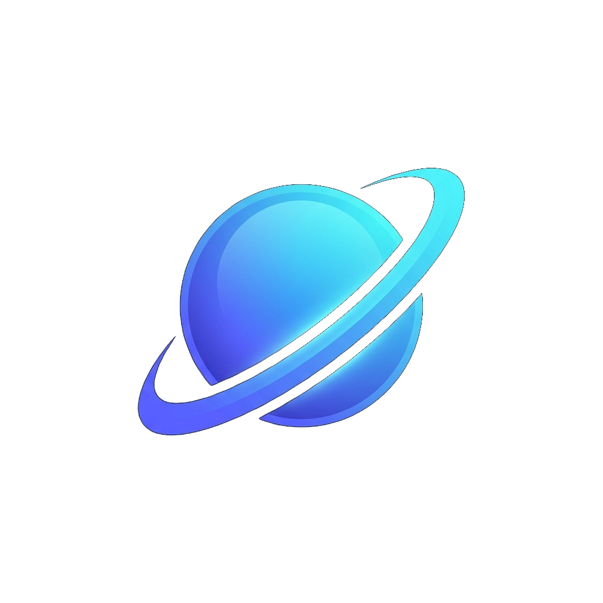
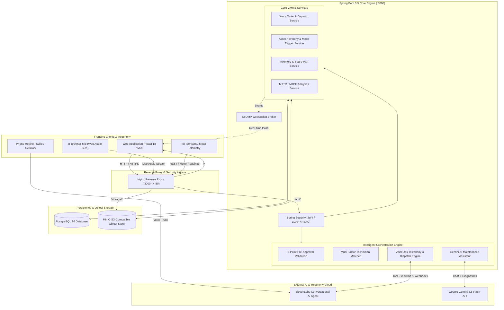
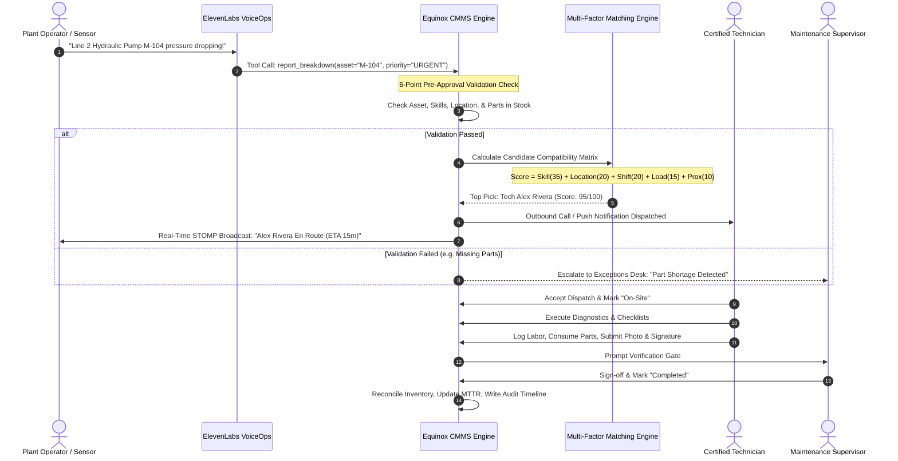
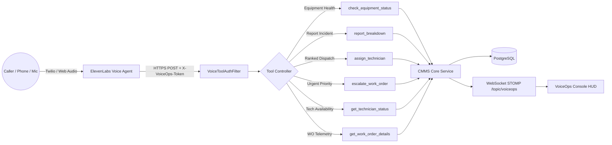

<div align="center">



# Equinox CMMS & FSM
### Next-Generation Industrial Equipment Maintenance & Field Service Orchestration Platform

*Intelligent Pre-Approval Validation • Multi-Factor Technician Matching • ElevenLabs Autonomous VoiceOps • Gemini AI Copilot*

---

[](https://spring.io/projects/spring-boot)
[](https://reactjs.org/)
[](https://www.typescriptlang.org/)
[](https://www.postgresql.org/)
[](https://min.io/)
[](https://www.docker.com/)
[](https://elevenlabs.io/)
[](https://deepmind.google/technologies/gemini/)
[](./LICENSE)

<br/>

**Built with pride by Team BucketNCo**

[Key Features](#-key-features) • [Architecture](#-system-architecture) • [VoiceOps & AI](#-voiceops--conversational-telephony) • [Matching Engine](#-intelligent-technician-matching-engine) • [Quickstart](#-quickstart--deployment) • [Team](#-team-bucketnco)

</div>

---

## 📌 Executive Summary

Modern industrial facilities and fleet operators lose millions annually to operational dead-time: machines stall, frontline operators rely on manual phone calls or text messages to raise tickets, dispatchers guess technician availability without checking certifications or transit corridors, and critical repair parts run out mid-job.

**Equinox CMMS** (Computerized Maintenance Management System & Field Service Management Platform) transforms the asset lifecycle from breakdown to verified restoration into an intelligent, data-driven pipeline. 

Equinox layers **automated pre-approval rule validation**, an **explainable 100-point multi-factor technician auto-assignment engine**, **autonomous voice dispatching and telephony triage via ElevenLabs**, and an **embedded Google Gemini maintenance copilot** on top of an enterprise-grade maintenance operations foundation.

---

## 👥 Team BucketNCo

Equinox CMMS is designed and engineered by **Team BucketNCo**:

| Member | Primary Role | Core Engineering Contributions |
| :--- | :--- | :--- |
| **Yashwant Gokul P** | **Team Lead & Full-Stack Architect** | VoiceOps ElevenLabs telephony engine, outbound auto-dispatch pipeline, Web Audio browser sessions, Gemini AI Copilot integration, Docker orchestration |
| **Manasa T** | **Full-Stack & Orchestration Engineer** | FSM orchestration workflow, role-based portals (Operator, Technician, Admin), service type routing, authentication & security profiles |
| **Dharshini S** | **Backend & Systems Specialist** | Asset lifecycle triggers, maintenance metrics, REST API controller layer, data validation rules, database integrity & Liquibase migrations |
| **Rohith Kumar S** | **DevOps & Integration Specialist** | Docker Compose topology, Nginx reverse proxy routing, MinIO S3 object storage setup, system configuration & deployment pipelines |
| **Santhosh** | **Algorithms & Backend Engineer** | 6-Point Pre-Approval Validation Service, Explainable Multi-Factor Technician Matching & Auto-Assignment Engine, candidate scoring algorithms |

---

## 🚀 Key Features

```
┌──────────────────────────────────────────────────────────────────────────────────────────────────┐
│                                       EQUINOX CMMS HIGHLIGHTS                                    │
├──────────────────────────┬──────────────────────────┬────────────────────────────────────────────┤
│ 🎙️ Autonomous VoiceOps  │ 🎯 Smart Dispatch Engine │ 🛡️ 6-Point Pre-Approval Validation        │
│ • Inbound hotline triage │ • 100-point explainable  │ • Asset existence & operational state check │
│ • Outbound phone alerts  │   matching algorithm     │ • Required technician skills verification  │
│ • Live Web Audio session │ • Proximity & travel fit │ • Spare-part BOM availability check        │
│ • STOMP WebSocket HUD    │ • Shift & workload aware │ • Conflict & duplicate ticket prevention   │
├──────────────────────────┼──────────────────────────┼────────────────────────────────────────────┤
│ 🤖 Gemini AI Copilot     │ 🏭 Complete CMMS Suite   │ 🔒 Enterprise Governance                   │
│ • Contextual diagnosis   │ • Work orders & kanban   │ • Role-Based Access Control (RBAC)         │
│ • Multi-turn tools       │ • Hierarchy & meters     │ • JWT + LDAP / Active Directory sync       │
│ • Safe action approvals  │ • Parts inventory & BOM  │ • S3 object storage + audit trails         │
└──────────────────────────┴──────────────────────────┴────────────────────────────────────────────┘
```

### 1. 🎙️ Autonomous VoiceOps (Powered by ElevenLabs)
- **Inbound AI Breakdown Hotline:** Plant floor technicians and operators can speak naturally in multiple languages to report breakdowns. The AI agent understands equipment context, asks diagnostic questions, and triggers actions without touching the database directly.
- **Outbound Automated Dispatch Calls:** When critical equipment trips to `DOWN` or `EMERGENCY_SHUTDOWN`, the system automatically rings the on-call specialist via Twilio/ElevenLabs telephony.
- **Browser-Native Voice Session:** Web Audio microphone streaming allows dispatchers and managers to interact hands-free with the system directly from the web browser.
- **Secure Deterministic Voice Tools (`/api/voice-tools/*`):** The voice agent executes actions strictly through authenticated, scoped tools with signature verification:
  - `check_equipment_status`
  - `report_breakdown`
  - `get_technician_status`
  - `assign_technician`
  - `escalate_work_order`
  - `get_work_order_details`
- **Real-Time WebSocket Stream:** Voice call events and tool executions stream live to the `/app/voice-ops` monitoring console over STOMP WebSocket.

### 2. 🎯 Explainable Multi-Factor Technician Matching Engine
- Evaluates candidate pools across **5 quantitative dimensions** to produce a 100-point compatibility score.
- Eliminates guesswork by providing dispatchers with an **explainable breakdown** of *why* a technician is recommended.
- Supports 1-click **Auto-Assign** or manual selection from a ranked candidate roster.

### 3. 🛡️ 6-Point Pre-Approval Validation Engine
Before any service request transitions to an active, assigned work order, the automated validation pipeline executes 6 rigorous gate checks:
1. **Asset Existence:** Validates target equipment presence within the corporate asset registry.
2. **Asset State:** Verifies machine status (flags already down or decommissioned equipment).
3. **Location Consistency:** Validates geofence and campus location bounds between asset and requester.
4. **Priority Calibration:** Enforces priority thresholds (Low, Medium, High, Urgent) matching equipment criticality.
5. **Technician Skill Availability:** Confirms active personnel holding required certifications (e.g., *L4 Hydraulics*, *High-Voltage PLC*).
6. **Spare-Part Inventory Check:** Validates warehouse stock on critical BOM replacement parts.

### 4. 🤖 Google Gemini AI Maintenance Copilot
- Context-aware conversational assistant embedded across the platform via `/app` interface.
- Executes safe, deterministic system tools (e.g., retrieving asset telemetry, drafting work orders, analyzing mean-time-between-failures) with **human-in-the-loop preview and confirmation cards**.

### 5. 🏭 Enterprise Asset & Maintenance Management
- **Work Orders:** Kanban board, Gantt/Workload scheduler, interactive calendar, multi-task checklists, labor timer tracking, and digital signature sign-off.
- **Asset Hierarchy:** Multi-level parent-child tree, multi-site grouping, downtime tracking, and preventive maintenance routines.
- **IoT & Meter Triggers:** Real-time sensor readings ingestion triggering automated maintenance when operating thresholds are breached.
- **Inventory & Spare Parts:** Warehouse tracking, minimum stock reorder thresholds, automated purchase order generation, and bill of materials (BOM).
- **Analytics & Reporting:** Live Mean Time To Repair (MTTR), Mean Time Between Failures (MTBF), Overall Equipment Effectiveness (OEE), and cost analytics.

---

## 🏗️ System Architecture

Equinox CMMS is designed with an API-first, containerized micro-service topology built for resilient on-premise or cloud deployments.



---

## 🔄 End-to-End Incident-to-Resolution Lifecycle

The diagram below illustrates how Equinox CMMS processes a machine breakdown from automated intake through resolution:



---

## 🎯 Intelligent Technician Matching Engine

Technician selection is computed via an explainable objective scoring function that evaluates all active personnel within the organization:

$$\text{Final Score} = S_{\text{skill}} + S_{\text{location}} + S_{\text{shift}} + S_{\text{workload}} + S_{\text{proximity}}$$

```
┌─────────────────────────┬──────────────┬────────────────────────────────────────────────────────┐
│ Criterion               │ Max Points   │ Evaluation Logic                                       │
├─────────────────────────┼──────────────┼────────────────────────────────────────────────────────┤
│ 1. Skill Matrix         │ 35 Points    │ Exact match on mandatory equipment certifications      │
│ 2. Location Alignment   │ 20 Points    │ Same plant/facility (20), general pool (10), remote (5)│
│ 3. Shift Availability   │ 20 Points    │ Active on-shift (20), on shift exception / off (5)     │
│ 4. Workload Capacity    │ 15 Points    │ 15 − (2 × Active Open Work Orders), bounded at 0       │
│ 5. Corridor Proximity   │ 10 Points    │ Immediate site perimeter (10), regional transit (5)    │
├─────────────────────────┼──────────────┼────────────────────────────────────────────────────────┤
│ TOTAL COMPATIBILITY     │ 100 Points   │ Full explainability reasons attached to each candidate │
└─────────────────────────┴──────────────┴────────────────────────────────────────────────────────┘
```

### Explainability Example in JSON Response
```json
{
  "technicianId": 104,
  "firstName": "Alex",
  "lastName": "Rivera",
  "score": 95.0,
  "reasons": [
    "Required skill matched: Master Hydraulics L4",
    "Registered at same location: Plant Alpha - Stamping Line",
    "On active shift / available",
    "Active workload: 1 open work order(s)",
    "Local site proximity"
  ]
}
```

---

## 🎙️ VoiceOps & Conversational Telephony

The VoiceOps subsystem bridges field voice communication with enterprise backend services without exposing the database to the AI agent:



### Autonomous Voice Tools Reference

| Tool Endpoint | Purpose | Parameters |
| :--- | :--- | :--- |
| `POST /api/voice-tools/equipment-status` | Inspect asset health & open incidents | `equipment_identifier` |
| `POST /api/voice-tools/report-breakdown` | File emergency work order ticket | `equipment_identifier`, `summary`, `priority` |
| `POST /api/voice-tools/assign-technician` | Run matching engine & assign technician | `work_order_id`, `technician_name` |
| `POST /api/voice-tools/escalate-work-order` | Bump SLA priority and alert supervisors | `work_order_id`, `reason` |
| `POST /api/voice-tools/technician-status` | Check field engineer location & shift | `technician_name` |
| `POST /api/voice-tools/work-order-details` | Fetch checklist and repair progress | `work_order_id` |

---

## 💻 Tech Stack & Infrastructure

| Layer | Technology | Version | Purpose |
| :--- | :--- | :--- | :--- |
| **Frontend** | React, TypeScript, Material-UI (MUI 5) | React 18 / MUI 5.8 | Responsive desktop & field tablet web interface |
| **State & Data** | Redux Toolkit, TanStack Table, FullCalendar | Redux 1.8 | State management, data grid tables, scheduling views |
| **Backend API** | Spring Boot, Spring Security, JPA/Hibernate | 3.5.16 (Java 17) | High-performance RESTful application server |
| **Database** | PostgreSQL | 16-Alpine | Relational persistence with Liquibase schema migrations |
| **Object Storage** | MinIO | S3 API Compatible | Storage for machine images, PDF manuals, signatures |
| **Ingress Proxy** | Nginx | 1.27-Alpine | Single-ingress routing, SSL termination, reverse proxy |
| **Voice AI** | ElevenLabs Conversational AI + Twilio | v1 Client | Multilingual telephony agent & real-time streaming |
| **Generative AI**| Google Gemini | `gemini-3.8-flash` | Maintenance assistant copilot & tool calling |
| **WebSockets** | STOMP over SockJS | RFC 6455 | Real-time voice logs, radar updates, ticket events |

---

## 📂 Project Structure

```
cmms/
├── api/                                # Java Spring Boot 3.5 Backend
│   ├── src/main/java/com/grash/
│   │   ├── controller/                 # 60+ REST Controllers (WorkOrders, Assets, etc.)
│   │   ├── service/                    # Business Logic Layer
│   │   │   ├── PreApprovalValidationService.java # 6-Point Request Validation
│   │   │   ├── TechnicianMatchingService.java   # 100-Point Candidate Matcher
│   │   │   └── assistant/              # Gemini AI Copilot & Tool Calling
│   │   ├── voiceops/                   # ElevenLabs Voice Agent & Telephony Engine
│   │   │   ├── ElevenLabsClient.java   # Outbound Call & Webhook Integration
│   │   │   ├── VoiceDispatchService.java# Asset-Down Triggered Auto-Dispatch
│   │   │   ├── VoiceToolService.java   # Deterministic Voice Tools Execution
│   │   │   └── VoiceOpsController.java # VoiceOps HUD & Session APIs
│   │   ├── model/                      # JPA Domain Entities
│   │   ├── security/                   # Spring Security, JWT, LDAP, API-Keys
│   │   └── repository/                 # Spring Data Repositories
│   ├── src/main/resources/
│   │   └── db/changelog/               # Liquibase Database Migrations
│   └── pom.xml                         # Maven Dependencies & Plugins
├── frontend/                           # React 18 TypeScript Web Application
│   ├── src/
│   │   ├── content/own/
│   │   │   ├── VoiceOps/               # Live Call Monitoring & Voice Session HUD
│   │   │   ├── WorkOrders/             # Smart Technician Assignment & Detail Views
│   │   │   ├── Requests/               # Pre-Approval Validation Checklist Cards
│   │   │   ├── Assets/                 # Equipment Tree & Downtime Analytics
│   │   │   └── Analytics/              # MTTR, MTBF, Cost & Performance Reports
│   │   ├── components/AssistantWidget/ # Gemini AI Floating Chat Copilot
│   │   └── router/                     # Application Routes & Protected Views
│   └── package.json                    # Node.js Dependencies
├── dev-docs/                           # Technical Guides & Setup Walkthroughs
│   ├── VoiceOps ElevenLabs setup.md    # Step-by-Step Voice Agent Configuration
│   ├── LDAP_SETUP.md                   # Enterprise Active Directory Integration
│   └── Set up TLS.md                   # SSL / Nginx Certificate Guide
├── logo/                               # High-Resolution Brand Identity Assets
├── docker-compose.yml                  # Production Multi-Container Orchestration
├── docker-compose.dev.yml              # Local Development Override Configuration
├── nginx.conf                          # Reverse Proxy Routing & Header Rules
└── Security.md                         # Security Disclosure & Vulnerability Policy
```

---

## ⚡ Quickstart & Deployment

### Prerequisites
- [Docker](https://docs.docker.com/get-docker/) (v24.0+) & [Docker Compose](https://docs.docker.com/compose/) (v2.20+)
- Minimum 8 GB RAM recommended for multi-container stack

### 1. Clone the Repository
```bash
git clone https://github.com/RohithKumar-2007/EquiNox-FSM.git
cd EquiNox-FSM
```

### 2. Configure Environment Variables
Copy `.env.example` to `.env` and configure your credentials:
```bash
cp .env.example .env
```

Key environment configurations:
```env
# Database Credentials
POSTGRES_USER=rootUser
POSTGRES_PWD=mypassword

# Security & Tokens
JWT_SECRET_KEY=sD1HBM6ngcaDLMzDqgA9Pn9LEECNAp0C1EOHIR/D+q4=
PUBLIC_SERVER_URL=http://localhost:3000

# MinIO Object Storage
MINIO_USER=minio
MINIO_PASSWORD=minio123

# Google Gemini AI Copilot
GEMINI_API_KEY=your_gemini_api_key_here
GEMINI_MODEL=gemini-3.8-flash

# ElevenLabs Autonomous VoiceOps
ELEVENLABS_API_KEY=your_elevenlabs_api_key_here
ELEVENLABS_AGENT_ID=your_inbound_hotline_agent_id
ELEVENLABS_TOOL_SECRET=your_random_16_char_secret
ELEVENLABS_SERVICE_USER_EMAIL=voice-agent@yourcompany.com
ELEVENLABS_AUTO_DISPATCH=true
```

### 3. Launch Services with Docker Compose
```bash
docker compose up -d --build
```

### 4. Access the Application
Once the containers are running healthy:
- **Web Application Portal:** [http://localhost:3000](http://localhost:3000)
- **Backend REST API:** [http://localhost:3000/api](http://localhost:3000/api)
- **MinIO Storage Console:** [http://localhost:9001](http://localhost:9001)
- **VoiceOps Mission Control:** [http://localhost:3000/app/voice-ops](http://localhost:3000/app/voice-ops)

---

## 🧪 Interactive Personas & Demo Walkthrough

Equinox CMMS supports multiple organizational roles. Test the end-to-end flow with these preconfigured persona flows:

| Persona | Role | Focus Capabilities |
| :--- | :--- | :--- |
| **Plant Operator** | `REQUESTER` | Submit breakdown requests, view real-time service radar, track technician arrival ETA |
| **Operations Dispatcher** | `ADMIN` / `MANAGER` | Review 6-Point Pre-Approval Validation checklist, execute 100-point technician matching, approve work orders |
| **Field Specialist** | `TECHNICIAN` | Field mobile HUD, accept dispatch, mark transit/on-site, execute checklists, submit photos & signature |
| **Maintenance Supervisor**| `ADMIN` | Supervise VoiceOps live hotline, monitor Gemini AI chat, review audit histories, sign off on verified completions |

### 8-Minute Golden Path Demo
1. **Report Breakdown:** Trigger a breakdown via the **VoiceOps Hotline** or click **New Request** for machine `M-104`.
2. **Pre-Approval Validation:** Inspect the 6-point checklist badge in the request details: *Asset Exists*, *Active State*, *Location Valid*, *Skills Available*, *Parts Reserved*.
3. **Smart Matching:** Click **Auto-Assign** or view the ranked candidate list; examine why technician Alex Rivera is ranked #1.
4. **Voice Dispatch Trigger:** Toggle asset state to `DOWN` to witness an automated outbound voice dispatch phone alert.
5. **Execution & HUD:** Log in as technician, start work, complete tasks, and sign off.
6. **Supervisor Verification:** Approve completion and observe automated inventory reconciliation and MTTR metric updates.

---

## 📜 License & Open Source Attribution

Equinox CMMS is distributed under the **GNU Affero General Public License v3.0 (AGPL-3.0)**. See the [LICENSE](./LICENSE) file for complete terms.

### Heritage & Proprietary Innovations
Equinox CMMS is built upon the open-source foundation of Atlas CMMS (AGPL-3.0). **Team BucketNCo** has extended the platform with novel architectural modules:
- **ElevenLabs Autonomous VoiceOps Subsystem:** Telephony dispatch pipeline, audio streaming, and authenticated voice tools.
- **6-Point Pre-Approval Request Validation Engine (`PreApprovalValidationService`):** Automated asset, skill, and BOM inventory gating.
- **Explainable 100-Point Multi-Factor Technician Matching Engine (`TechnicianMatchingService`):** Multi-factor candidate scoring and ranked assignment.
- **Google Gemini Maintenance Assistant Copilot:** Contextual chat widget with preview/confirm tool calling.
- **Modernized Container & Ingress Architecture:** Hardened Nginx reverse proxy configuration and WebSocket event streaming.

---

<div align="center">

**Equinox CMMS — Intelligent Maintenance & Service Orchestration**  
*Developed with ❤️ by Team BucketNCo*

</div>
